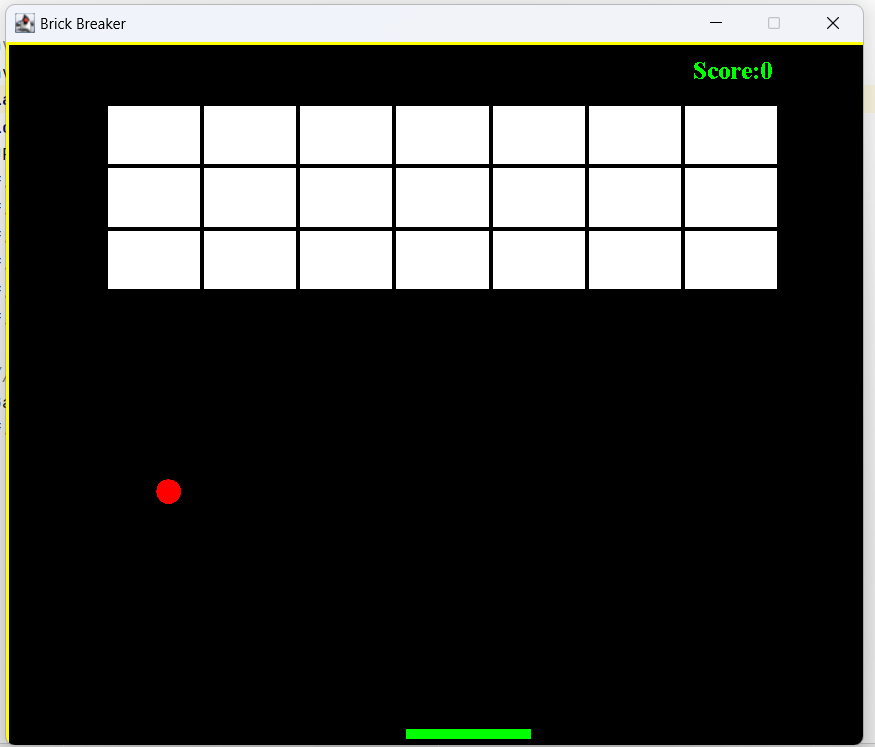

## Preview
###### What is Brick Breaker Game in Java?
A Brick Breaker Game in Java consists of bricks aligned at the top of the screen. The player is represented by a small ball that is put at the bottom of the screen on a small platform. The platform on the screen can be moved from left to right using the arrow buttons on the computer. The platform is used by the player to keep the ball moving. The goal is to smash as many bricks as possible while avoiding hitting the ball with your platform.
### First Look

### Started Game

### Game Over

<!---

[//]: # (![Brick Breaker Game]&#40;/assets/image/game.png "Brick Breaker Game Preview"&#41;)
[//]: # (![Brick Breaker Game]&#40;/assets/image/play%20game.png "Brick Breaker Game Preview"&#41;)

[//]: # (![Brick Breaker Game]&#40;/assets/image/over%20game.png "Brick Breaker Game Preview"&#41;)

-->